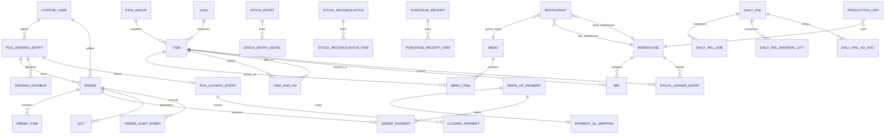

# Data Model

## Major Entity Diagram

## Shared Conventions

Most project domain models extend `apps.utils.models.BaseModel`, adding `created_at` and `updated_at`; `users.CustomUser` instead extends Django's `AbstractUser`. Money and quantities use `DecimalField`; no money uses `FloatField`. Foreign keys for historical business documents generally use `PROTECT` or `SET_NULL`. Child rows of draft documents use `CASCADE` where deleting the parent is still allowed.

## Settings and Routing

- `Restaurant`: singleton enforced by `singleton_key` and `clean()`. `load()` returns the first row with active menu and warehouse relations loaded. Since Phase 6 it also carries accounting FKs: `default_income_account`, `default_expense_account`, `round_off_account`, `account_for_change_amount`, `write_off_account`, `wastage_account`, `cash_shortage_account`, `cash_over_short_account`, `cost_center`, `write_off_cost_center`, and `variance_approval_threshold` (all nullable except where settlement enforces them).
- `ProductionUnit`: one row per department via a unique constraint. Stores station warehouse, takeaway-ticket suppression, printer metadata, and `income_account` (the departmental income hook).
- `ItemGroup`: flat category; since Phase 6 it carries optional `income_account`/`expense_account` FKs used in GL account resolution.
- `Warehouse`: flat stock location; since Phase 6 it carries an optional `account` FK credited with the stock value of settle-time drink deductions.
- Warehouse role is inferred from references, not a warehouse type field.

## Product and Menu Entities

- `ItemGroup`: flat category.
- `UOM`: stock unit.
- `Item`: item master with independent `is_sales_item`, `is_stock_item`, and `is_purchase_item` flags. `has_variants=True` makes it a non-sellable/non-purchasable template in `Item.save()`.
- `Menu`: named enabled collection.
- `MenuItem`: priced item on a menu, unique per menu/item, with denormalized name and special/disabled flags.
- `ItemAddOn`: parent/add-on relationship; the add-on price is resolved from the active menu, not stored here.
- `ItemVariant`: parent/variant relationship. It is modeled, but no current POS variant selector uses it.

## Stock Entities

- `Bin`: current actual quantity, reserved quantity, valuation rate, and stock value for one item/warehouse pair.
- `StockLedgerEntry`: signed movement with running quantity and serialized FIFO queue. The voucher type/number/detail fields link it back to source documents.
- `StockEntry` and `StockEntryDetail`: receipt or Store-to-Kitchen/Bar transfer.
- `StockReconciliation` and `StockReconciliationItem`: counted quantity adjustment with reason and warehouse.
- `PurchaseReceipt` and `PurchaseReceiptItem`: supplier goods into the central Store.

## Order Entities

- `Order`: one operational sale/return document. It owns totals, status, shift, cashier, receipt-printed state, warehouse snapshot, return linkage, and audit history.
- `OrderItem`: line snapshot with item name, rate, amount, department, stock flag, menu line, comments, customer index, optional return source, and `not_restockable` (return drafts only — when set, the returned stock is not restored and posts wastage).
- `OrderPayment`: payment line inside an order. Positive on sales; negative refund rows only on return orders. It is protected from edits after the order is submitted or ticketed.
- `KOT`/`KOTItem`: immutable order-to-station snapshots; KOT print status is mutable for dispatch/retry.
- `OrderAuditEvent`: append-only event row. It uses `PROTECT` from the order and refuses update/delete.
- `OrderSequence`: locked counter used for human-facing order numbers.

## Shift and Payment Entities

- `POSOpeningEntry`: global shift parent. Open means `SUBMITTED` with no closing link; closed means `SUBMITTED` with a closing link.
- `OpeningPayment`: mode-specific opening balance.
- `POSClosingEntry`: one-to-one reconciliation document linked to the opening. Carries `variance_note` (required beyond the approval threshold) and `variance_journal_entry` (linked JE when the close posts a variance).
- `ClosingPayment`: counted, expected, and difference values per opening mode.
- `ModeOfPayment`: enabled payment master with one conditional default.
- `PaymentGLMapping`: one-to-one mode-to-ledger-account mapping (`default_account` is a `LedgerAccount` FK, leaf-only).

## Accounting Entities

- `LedgerAccount`: chart-of-accounts node. Flat FK `parent` tree; roots declare `root_type` (ASSET/LIABILITY/EQUITY/INCOME/EXPENSE) and children inherit it. `is_group` nodes hold children; only leaves receive postings. `freeze_account` blocks new postings; `disabled` hides the account. Deletion is PROTECTed by GL rows, journal rows, payment mappings, and configured FKs.
- `FiscalYear`: enabled years must not overlap; `get_for(date)` returns the enabled year covering a date or raises.
- `CostCenter`: flat tree (groups + leaves), stamped on GL entries and journal rows.
- `GLEntry`: one side of a posting — exactly one non-zero debit/credit. Immutable after creation: `save()` blocks edits except the `is_cancelled` reversal flag, `delete()` raises. `post()` resolves the fiscal year from the posting date.- `JournalEntry`: manual voucher (JOURNAL/CASH/BANK/WRITE_OFF/OPENING), DRAFT → SUBMITTED → CANCELLED. `submit()` requires balance, unique account+cost-center rows, and a positive total; OPENING vouchers set `is_opening` and reject a second opening for the same fiscal year. `cancel()` posts mirrored negated GL rows and marks originals cancelled. `amend()` copies a CANCELLED entry into a new DRAFT linked via `amended_from`; only one amendment per cancelled entry — a cancelled entry that already has an amendment cannot be amended again (its amendment is the next link).
- `JournalEntryAccount`: debit/credit row on a journal entry; one of debit/credit must be non-zero, leaf accounts only.

## Reports Entities

- `PnLConfiguration`: singleton (`load()` get-or-creates) for business-day start hour, electricity rate, daily depreciation, and whether to include cash variance.
- `PnLMaterial` / `PnLRecurringExpense`: catalogs of consumables and remembered expense templates (daily, monthly ÷ days-in-month, % of gross, employee).
- `DailyPnL`: one DRAFT and one SUBMITTED row per `business_date`. Management snapshot — submit does not post GL. `cancel()` is status-only; `amend()` copies inputs into a new draft.
- `DailyPnLLine`: frozen statement rows written on submit (FOOD / DRINKS / TOTAL plus % of gross). Kitchen consumption and prime cost are memo lines (`is_memo`).
- `DailyPnLMaterialQty` / `DailyPnLAdHoc`: draft inputs. `DailyPnLCogsRow` / `DailyPnLConsumptionRow`: drink COGS and kitchen-consumption breakups written on submit.

## Important Constraints and Methods

- `Order` constrains guest count, cancellation reason, and unique human order number.
- `OrderItem` constrains positive normal quantity, non-negative rate, customer index, and `not_restockable` on return lines only (DB check constraint); return lines are negative and linked to source lines.
- `Order.save()`, `OrderItem.save/delete()`, `OrderPayment.save/delete()`, KOT saves, and audit-event saves enforce historical protections.
- Inventory document saves reject most post-submit mutations, but service functions remain required because direct status changes can bypass posting.
- `StockLedgerEntry` has no model-level save/delete immutability guard; `editable=False` does not protect direct ORM writes.

## Migration History Signals

The current schema is the result of substantial cleanup migrations, not the older plan vocabulary. Important current-history markers include:

- `settings/0017_single_location_data.py` and `0018_remove_restaurant_branch_remove_posprofile_branch_and_more.py`: move toward the single Restaurant configuration and remove Branch/POSProfile structures.
- `settings/0023_restaurant_singleton_key_and_more.py` and `0024_restaurant_store_warehouse_and_more.py`: enforce the singleton key and central Store warehouse semantics.
- `inventory/0014_hardcode_fifo.py`, `0015_simplify_stock_entry.py`, and `0019_item_sales_purchase_flags.py`: establish current FIFO and independent item flags.
- `inventory/0022_stockreconciliation_reason_and_more.py` through `0025_alter_item_image.py`: required reconciliation reasons and current item image default.
- `menu/0006_remove_pricelist_menu_delete_itemprice_and_more.py`: remove legacy PriceList/ItemPrice models.
- `payments/0003_alter_paymentglmapping_options_and_more.py` and `0004_modeofpayment_payments_one_default_mode.py`: current one-to-one GL mapping and one-default invariant.
- `accounting/0001_initial.py`: the chart of accounts, GL entries, journal entries, fiscal years, and cost centers.
- `payments/0005_payment_gl_mapping_fk.py`: converts `PaymentGLMapping.default_account` from a name string to a `LedgerAccount` FK, matching existing strings case-insensitively and creating missing leaves under Assets.
- `settings/0026_productionunit_income_account_and_more.py`, `inventory/0026_*`, `orders/0025_orderitem_not_restockable.py`, `orders/0026_orderitem_orders_item_not_restockable_return_only.py` (the DB-level guard), and `staff/0006_posclosingentry_variance_journal_entry_and_more.py`: Phase 6 accounting FKs and variance fields.

When a model appears to conflict with `FEATURES.md` or `docs/archive/PLAN-history.md`,
inspect the latest model and migrations first. The archive contains deferred or removed
concepts and is not the live schema.
