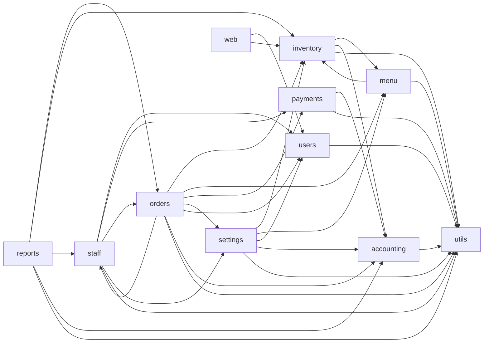

# Cross-App Dependencies

## Dependency Graph



## Core Relationship Chains

### Catalog to order

`Restaurant.active_menu` -> `Menu.items` -> `MenuItem.item` -> `Item`. `views_pos._build_order_context()` loads active, enabled menu lines and groups them by `Item.item_group`. `pos_order_add_item()` resolves the inventory item, while `services.apply_add_on_line()` resolves the active-menu price and stores `OrderItem.menu_item`.

### Order to shift

`Order.opening_entry` -> `POSOpeningEntry`. Draft creation, settlement, POS history, and closing all filter through this relationship. `OrderQuerySet.open_drafts()` and `submitted_in_shift()` are the shared query semantics used by POS and staff services.

### Order to inventory

An order line snapshots the item department and stock flag. Only DRINKS lines call `reserve_drink_stock()` and later `_convert_drink_reservations()`. Those functions lock `inventory.Bin` rows and create `StockLedgerEntry` rows. FOOD POS lines do not change inventory.

### Order to production

`OrderItem.department` selects `settings.ProductionUnit.department`. `create_tickets()` creates one KOT/BOT per department, stores station and customer index snapshots, then `dispatch_tickets()` calls the order printing interface.

### Payment to shift

`OrderPayment.mode_of_payment` -> `ModeOfPayment`; `POSOpeningEntry.opening_payments` and `POSClosingEntry.closing_payments` use the same payment master. Settlement accepts only enabled modes that were declared at shift opening and have a `PaymentGLMapping` pointing at a leaf account. Closing aggregates order payment rows by mode, subtracts cash change, and subtracts submitted return refunds per mode.

### Order to GL

`settle_order` calls `accounting.services.post_order_gl` inside its atomic block after the order flips SUBMITTED and drink deductions are written. Income resolves ProductionUnit (by line department) → Restaurant default; COGS uses the FIFO outgoing value of the settle-time drink SLEs against the warehouse account, expensed to the Restaurant default expense account. Change fails closed unless `Restaurant.account_for_change_amount` is set. Posting fails closed if any account lands on both the debit and credit side of the voucher (e.g. a payment mode mapped to an income account) — such legs would otherwise net to zero and vanish. Returns post refund GL via `post_refund_gl` rebuilt from the returned lines; non-restockable drink lines post wastage at the settle-time outgoing rate. The variance JE on shift close flows through `staff.services.submit_closing_entry` → `accounting.services.post_cash_variance_gl`.

### Settings to stock routing

`Restaurant.store_warehouse` is the receipt/transfer source. `Restaurant.default_warehouse` is the Bar/POS DRINKS warehouse. The FOOD `ProductionUnit.warehouse` is the Kitchen warehouse. `Restaurant.clean()` and `ProductionUnit.clean()` enforce compatibility, while inventory submission repeats the operational checks.

## Direct Imports and Coupling Hotspots

- `apps/orders/services.py` imports inventory models, menu models, payment models, and uses local imports for settings, staff, and production units. This is the strongest cross-app coupling point.
- `apps/orders/views_pos.py` imports staff forms/services, settings, inventory, menu, payments, users, and order services because the POS surface spans all domains.
- `apps/staff/services.py` queries orders and payment rows to calculate shift totals.
- `apps/settings/models.py` imports orders and inventory inside `Restaurant.clean()` to prevent unsafe warehouse changes.
- `apps/inventory/models.py` imports settings and menu inside validation/save methods to prevent disabling configured warehouses or unselling active menu items.
- `apps/menu.models` imports inventory `Item` directly, so inventory master state controls menu eligibility.
- `apps/web.context_processors.inventory_navigation()` queries inventory for every backoffice template context.

## Indirect Coupling

- `Order.delete()` imports `apps.orders.services.release_drink_reservations()` to release stock reservations before deletion.
- `UserConfig.ready()` and `InventoryConfig.ready()` register `post_migrate` seed callbacks.
- Every backoffice and POS view declares its role requirement via `apps/users/decorators.py`; `LoginRequiredMiddleware` enforces site-wide login.
- HTMX templates depend on exact partial anchors such as `#pos-main`, `#cart-panel`, `#catalog-workspace`, and `#order-details-drawer`.
- `MessagesMiddleware` depends on `HX-Trigger` and `HX-Redirect`; `assets/javascript/toast.js` depends on the resulting `showMessages` event.

## Execution Chains

```text
POS add drink
  -> orders.views_pos.pos_order_add_item
  -> orders.services.apply_add_on_line
  -> orders.services.add_order_line
  -> inventory.Bin.reserved_qty
  -> orders.OrderItem and Order totals
  -> cart HTML + catalog out-of-band swap
```

```text
POS settlement
  -> orders.views_pos.pos_order_settle
  -> orders.services.settle_order
  -> staff.POSOpeningEntry validation
  -> payments.ModeOfPayment and PaymentGLMapping validation
  -> inventory.Bin locks and StockLedgerEntry for drinks
  -> orders.OrderPayment, Order status, audit event
  -> accounting.services.post_order_gl (income, payment, round-off, COGS)
  -> POS home redirect
```

```text
Shift close
  -> orders.views_pos.pos_close_shift or staff.views.closing_entry_submit
  -> staff.services.submit_closing_entry
  -> orders.submitted_in_shift and OrderPayment aggregation, minus return refunds
  -> staff.ClosingPayment differences
  -> staff.POSClosingEntry submitted
  -> accounting.services.post_cash_variance_gl (shortage/excess JournalEntry, when configured)
  -> staff.POSOpeningEntry.closing_entry set
```
