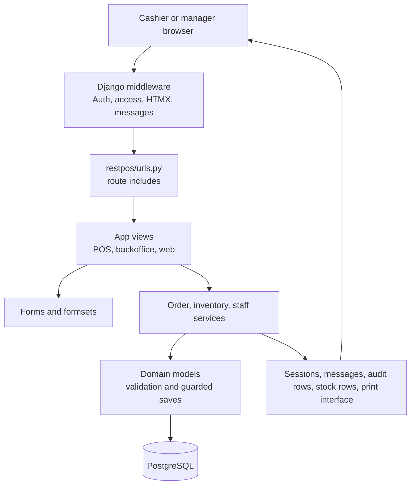

# Architecture Overview

## System Shape

RestPOS is a Django monolith with server-rendered HTML. The cashier POS and manager backoffice share the same Django process, database, session store, templates, and domain services. HTMX replaces portions of the page; Alpine.js handles local UI state. There is no active REST API, React/Vue frontend, report app, customer app, or print-agent client in the current source tree.

## Project Boundaries

- `restpos/` contains settings, root URLs, WSGI, and Celery configuration.
- `apps/` contains the active project packages. They are top-level packages, not children of `restpos/`.
- `templates/` contains the shared web shell, backoffice pages, POS pages, auth pages, and inline Django partials.
- `assets/` contains Vite source JavaScript and CSS. `assets/javascript/site.js` is the main browser entry.
- `media/` contains uploaded item/profile media and the default item image.
- PostgreSQL is the source of truth for operational state. Redis is configured for production cache and Celery broker/result storage; no project Celery task is currently defined.

## Runtime Request Lifecycle

1. Django loads `restpos.settings`, including the custom user model and app URLs.
2. `AuthenticationMiddleware` sets `request.user`; `BackofficeAccessMiddleware` gates `/backoffice/` and `/pos/` by role.
3. `HtmxMiddleware` exposes `request.htmx` to views and templates.
4. A route in `restpos/urls.py` selects a web, POS, or backoffice view.
5. Views parse request data, resolve records, and delegate multi-record changes to `apps.orders.services`, `apps.inventory.services`, or `apps.staff.services`.
6. Model methods validate snapshots, status transitions, money, stock lines, and relationship constraints.
7. The view renders a full page or a Django inline partial. HTMX replaces the requested target and `MessagesMiddleware` adds toast events where needed.

## URL Precedence Note

`restpos/urls.py` includes `apps.orders.pos_urls` at `/pos/` before including `apps.web.urls`. `apps.web.urls` also declares `web:pos_index` at `/pos/`, but the earlier include wins for requests. The reverse name exists, but `web.views.pos_index()` is effectively shadowed by `pos:pos_home`.

## Business Logic Placement

- Order lifecycle, payment validation, drink reservation, ticket creation, and receipt claim logic: `apps/orders/services.py`.
- Order immutability, line snapshots, totals, and audit-event append rules: `apps/orders/models.py`.
- Stock posting, FIFO queue updates, reversal entries, and inventory document lifecycle: `apps/inventory/services.py` and `apps/inventory/models.py`.
- Shift opening/closing and payment reconciliation: `apps/staff/services.py` and `apps/staff/models.py`.
- Menu, settings, and payment master CRUD mostly uses forms and direct model saves from views.

## Infrastructure and Integrations

- PostgreSQL: configured in `restpos/settings.py:136-151`; Docker service in `docker-compose.yml`.
- Redis: configured for cache and Celery in `restpos/settings.py:288-308`; debug mode uses `DummyCache`.
- Authentication/email: django-allauth under `/accounts/`, Django email backend, and admin signup notifications.
- Sites: `apps/web/meta.py` and `apps/web/migrations/0001_initial.py`.
- Printing: `apps/orders/printing.py` currently returns successful simulated results. ProductionUnit stores printer settings, but no ESC/POS, HTTP, USB, LAN, or socket implementation exists.
- Assets: Vite writes manifest-backed output into `static/`; development runs Django and Vite through `scripts/dev.sh`.

## Actual Scope Boundaries

The current code intentionally has no `apps/customers`, `apps/reports`, `apps/receipts`, or `apps/printing`. Customer grouping means `Order.guest_count` and `OrderItem.customer_index`, not a customer master. Shift totals and dashboards provide the reporting currently present. Receipt/KOT printing is an orders abstraction, not a separate integration.
