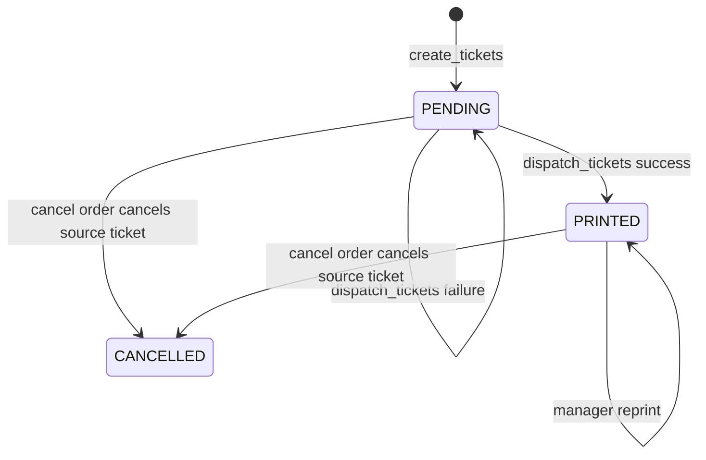
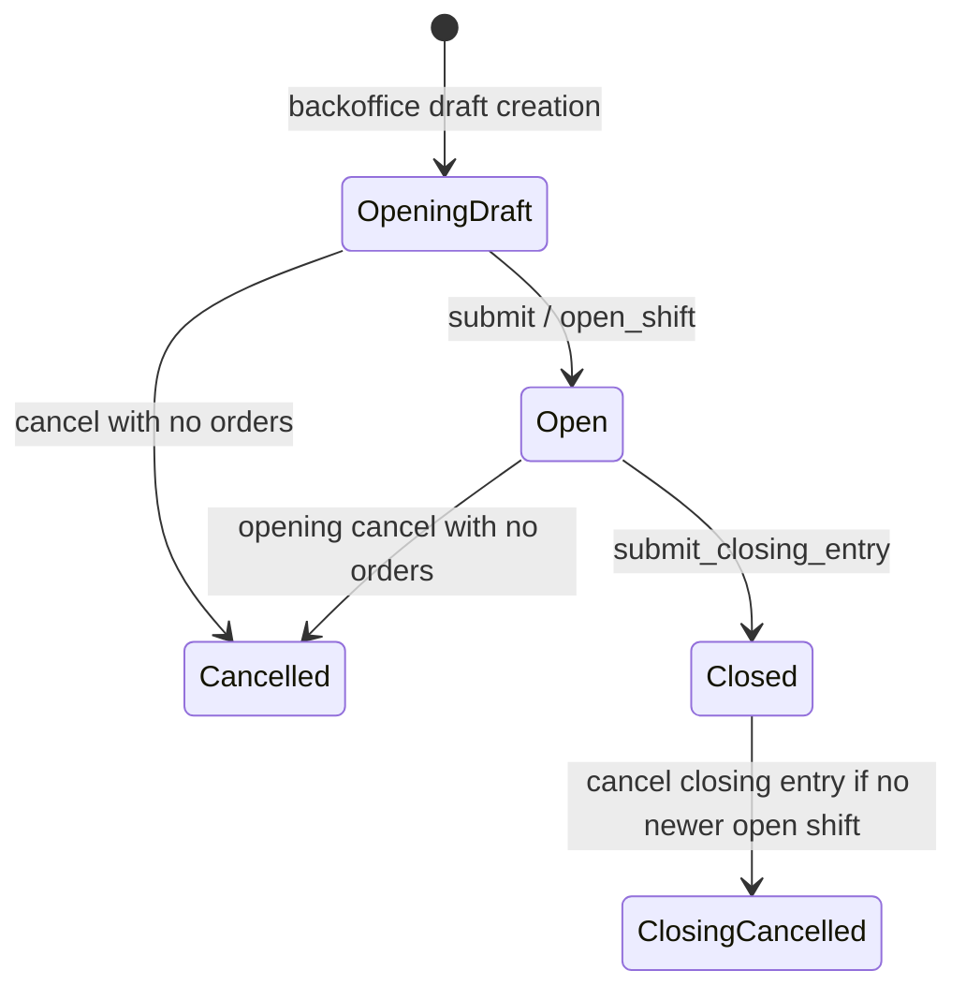
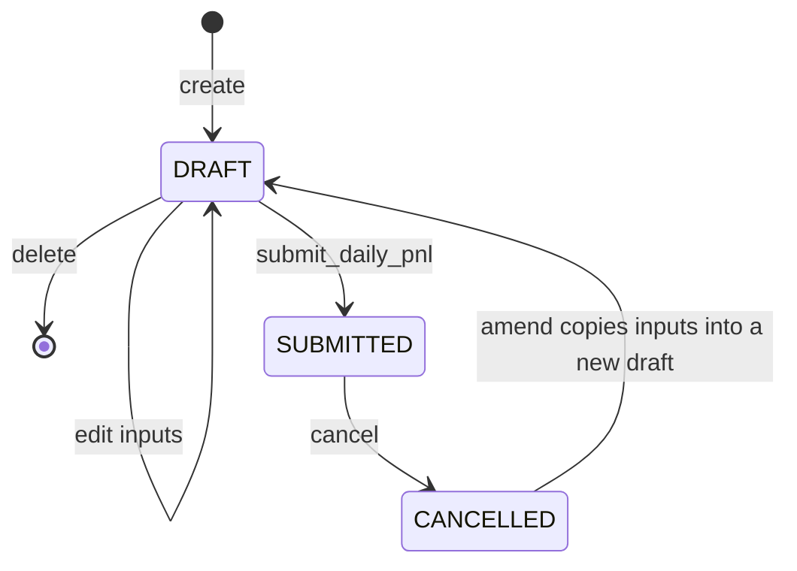

# State Machines

## Orders

```mermaid
stateDiagram-v2
    [*] --> DRAFT: create_draft_order
    DRAFT --> DISCARDED: delete_unsent_draft (tombstone)
    DRAFT --> SUBMITTED: settle_order
    DRAFT --> CANCELLED: cancel_sent_order if KOT sent
    DRAFT --> DISCARDED: discard_order (legacy/seed only)
    SUBMITTED --> DRAFT: make_return creates a new return draft
    DRAFT --> SUBMITTED: submit_return (return draft only)
    CANCELLED --> [*]
    DISCARDED --> [*]
    SUBMITTED --> [*]: (returns immutable; refund flow only)
```

- `Order.save()` blocks direct lifecycle changes and the services use `_transition()` flags for the intended transition.
- Paid submitted orders cannot be cancelled; `make_return()` creates a separate negative return draft and `submit_return()` submits it.
- An unsent draft (no KOT) has exactly one exit: delete (abandon). `delete_unsent_draft()` marks the draft `DISCARDED` with a `discarded_by`/`discarded_at` stamp and an `ORDER_DELETED` audit event carrying the actor and an item snapshot; the order row, items, and full audit trail survive as a tombstone.
- `Order.delete()` refuses hard deletion outright, so no code path can purge audit events.
- `discard_order()` requires an empty, unprinted, unsent, unpaid draft and only survives for legacy seed data; the tombstone fields are shared with the delete path.
- `DRAFT` editing stops only when a KOT exists; `invoice_printed` is no longer a draft lock.

## KOT and BOT

The KOT `status` (`SUBMITTED`/`CANCELLED`) and `print_status` (`PENDING`/`PRINTED`/`CANCELLED`) are separate. Cancellation tickets are new submitted KOT rows and can independently be retried. `KOT_PRINT_CANCELLED` exists as a choice but no inspected workflow sets it.

## Shifts

- `POSOpeningEntry.status` remains `SUBMITTED` after close; `closing_entry_id` distinguishes open from closed.
- Opening submission is serialized by locking the `Restaurant` row and open shift rows.
- Cancelling a closing entry does not reopen the opening entry.

## Daily P&L

- One DRAFT and one SUBMITTED document per `business_date`.
- Submit freezes statement lines and totals; it does not post GL.
- Cancel is status-only. The snapshot rows stay on file.
- Amend is allowed only from CANCELLED and creates a new DRAFT linked via `amended_from`.

## Inventory Documents

`StockEntry`, `StockReconciliation`, and `PurchaseReceipt` use `DRAFT -> SUBMITTED -> CANCELLED`. Submission creates SLE rows. Cancellation creates reverse SLE rows and marks source SLEs cancelled. A service call on a non-draft/non-submitted document is generally idempotent and returns the current status.

## Invalid Transitions to Watch

- `settle_order()` rejects cancelled, submitted, empty, return, or no-active-shift orders.
- `cancel_sent_order()` rejects discarded orders, paid orders, and unsent drafts (delete instead). Submitted orders are never cancelled — they leave the lifecycle only through the return flow (`make_return()` → `submit_return()`).
- `Order.delete()` refuses hard deletion for every status; unsent drafts leave `DRAFT` only through `delete_unsent_draft()`, which tombstones them as `DISCARDED`.
- Inventory model saves can permit direct draft status flips without posting; use service paths when tracing actual ledger behavior.
