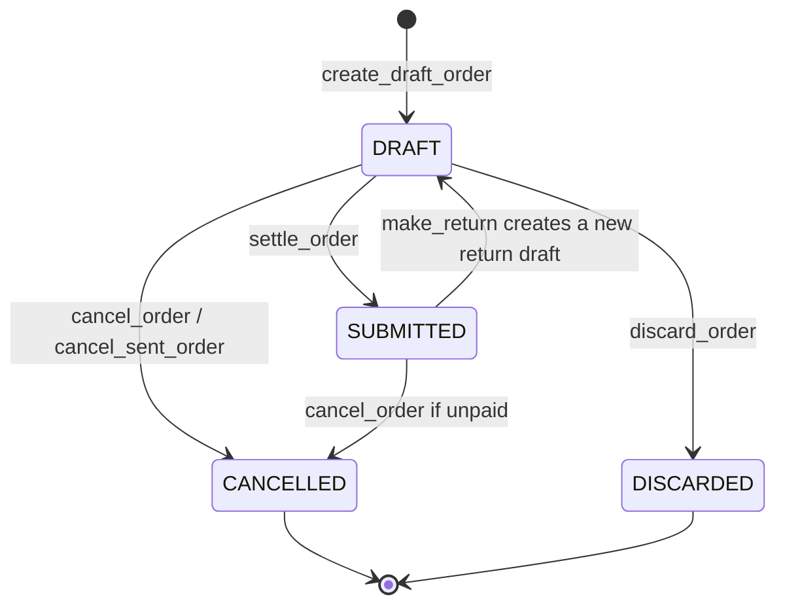
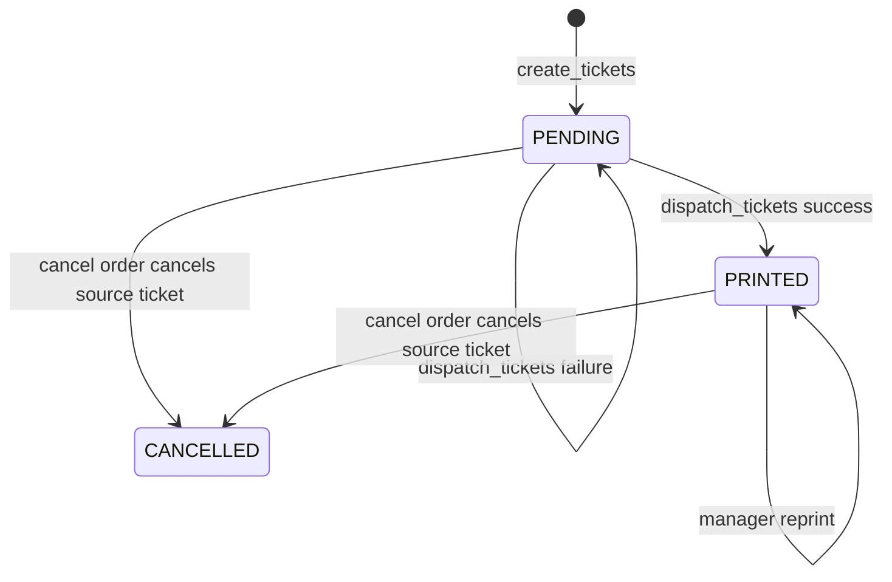
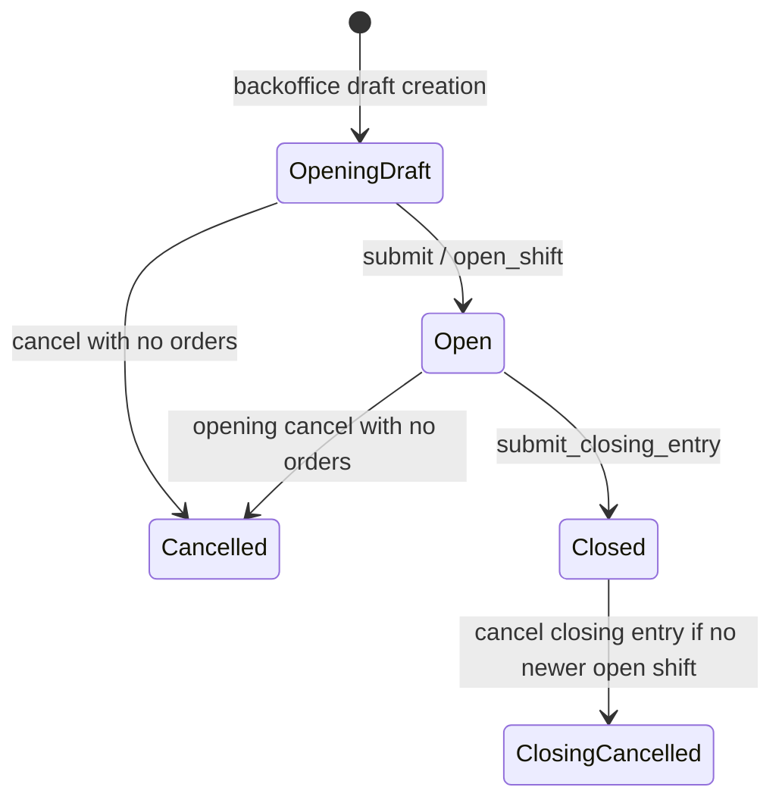

# State Machines

## Orders

- `Order.save()` blocks direct lifecycle changes and the services use `_transition()` flags for the intended transition.
- Paid submitted orders cannot be cancelled; `make_return()` creates a separate negative draft instead.
- Discard requires an empty, unprinted, unsent, unpaid draft.
- `DRAFT` editing also stops after a KOT or receipt claim.

## KOT and BOT

The KOT `status` (`SUBMITTED`/`CANCELLED`) and `print_status` (`PENDING`/`PRINTED`/`CANCELLED`) are separate. Cancellation tickets are new submitted KOT rows and can independently be retried. `KOT_PRINT_CANCELLED` exists as a choice but no inspected workflow sets it.

## Shifts

- `POSOpeningEntry.status` remains `SUBMITTED` after close; `closing_entry_id` distinguishes open from closed.
- Opening submission is serialized by locking the `Restaurant` row and open shift rows.
- Cancelling a closing entry does not reopen the opening entry.

## Inventory Documents

`StockEntry`, `StockReconciliation`, and `PurchaseReceipt` use `DRAFT -> SUBMITTED -> CANCELLED`. Submission creates SLE rows. Cancellation creates reverse SLE rows and marks source SLEs cancelled. A service call on a non-draft/non-submitted document is generally idempotent and returns the current status.

## Invalid Transitions to Watch

- `settle_order()` rejects cancelled, submitted, empty, return, or no-active-shift orders.
- `cancel_order()` rejects discarded orders and paid submitted orders.
- `Order.delete()` rejects non-drafts, printed drafts, sent drafts, and audited rows may also be blocked by `OrderAuditEvent.PROTECT`.
- Inventory model saves can permit direct draft status flips without posting; use service paths when tracing actual ledger behavior.
