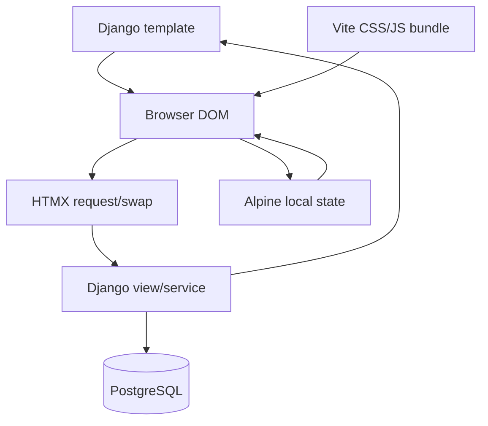

# Frontend Overview

## Rendering Model

The frontend is Django templates plus HTMX and Alpine.js. Vite bundles JavaScript/CSS but does not own page rendering. Django remains responsible for catalog data, cart HTML, totals, permissions, messages, and all business validation.

## Template Inheritance

- `templates/web/base.html`: shared application/public base, Vite CSS, CSRF headers, messages, and site JavaScript.
- `templates/web/public_base.html`: public landing/auth shell.
- `templates/web/app/app_base.html`: backoffice navigation and `#app-content` target.
- `templates/pos/base.html`: full-height POS shell, user menu, POS navigation, and `#pos-main` target.
- `templates/pos/index.html`: POS surface with inline partials `surface`, `catalog_workspace`, `cart`, and `payment_dialog`.

## POS DOM Surfaces

| Target | Server response | Main callers |
|---|---|---|
| `#pos-main` | full POS surface | navigation, home, history, close shift |
| `#cart-panel` | cart wrapper via `pos/index.html#cart` | add/update/meta/clear/ticket actions |
| `#catalog-workspace` | catalog workspace | search, category, special filters |
| `#catalog-grid` | out-of-band grid | cart mutations with `catalog_oob` |
| `#payment-dialog-container` | payment dialog | GET settle |
| `#add-on-dialog-container` | add-on dialog | GET add-on dialog |
| `#order-details-drawer` | history drawer partial | history row/detail print |

## Backoffice Frontend

Most backoffice pages are full HTML responses extending `app_base.html`. HTMX is used selectively for staff role rows, destructive deletes, and inventory formset row add/remove. Alpine provides local select-driven visibility and simple filter submission. `searchable-select.js` initializes Tom Select on ordinary form selects after initial load and HTMX swaps.

## Asset Build

`vite.config.ts` builds CSS, `site`, `app`, `landing`, and `floor-plan` entries into `static/` with a manifest for django-vite. `site.js` imports HTMX, Alpine, drawer, logout, toast, confirmation, and searchable-select behavior. `app.js` and `floor-plan.js` are built entries, but no active template reference was found for them.

## Frontend/Backend Authority

Client-side previews calculate opening/closing totals and payment entered totals for immediate feedback. The server recalculates totals, checks shifts, stock, permissions, and state transitions. Disabled buttons and hidden controls are affordances, not authorization.
