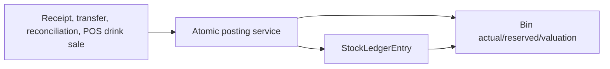

# Inventory Workflow

## Inventory Architecture

Inventory has a current-state layer (`Bin`) and an append-only movement layer (`StockLedgerEntry`). Documents are draft containers; their service functions are what post movements. The ledger uses signed quantities and a serialized FIFO queue.

## Every Production Inventory Mutation

| Path | Movement | Code |
|---|---|---|
| Material Receipt | Positive quantity into central Store | `inventory.services.submit_stock_entry()` |
| Material Transfer | Negative Store issue plus positive Kitchen/Bar receipt | `submit_stock_entry()` |
| Purchase Receipt | Positive quantity into central Store | `submit_purchase_receipt()` |
| Stock Reconciliation | Signed difference to counted quantity | `submit_stock_reconciliation()` |
| POS DRINKS settlement | Negative quantity from order warehouse | `orders.services._convert_drink_reservations()` |
| Submitted DRINKS cancellation | Positive reversal quantity | `orders.services._restore_stock()` |
| Draft drink cart mutation | `Bin.reserved_qty`, not actual stock | `orders.services.reserve_drink_stock()` |

FOOD POS sales intentionally do not reserve or deduct stock. Kitchen consumption is an explicit `CONSUMPTION` reconciliation at the FOOD production warehouse.

## Bins and Reservations

`Bin` is unique per item/warehouse. DRINKS draft lines reserve `actual_qty - reserved_qty`; the order pins the configured Bar/POS warehouse on first reservation. Add, increase, decrease, remove, clear, draft cancel, draft discard, and draft deletion synchronize reservations. Settlement subtracts the order-owned reservation before creating the actual issue.

## FIFO Posting

`StockLedgerEntry._create_entry_locked()` locks a Bin, loads the latest non-cancelled SLE queue, appends incoming `[qty, rate]` batches, or consumes oldest batches for issues. It records incoming/outgoing/valuation rates, running quantity, stock value, and the serialized queue. `prevent_negative=True` rejects a source issue that would make actual quantity negative.

## Documents

### Stock Entry

Supports `MATERIAL_RECEIPT` and `MATERIAL_TRANSFER`. Receipts land at `Restaurant.store_warehouse`. Transfers are only Store -> FOOD production warehouse or Store -> `Restaurant.default_warehouse` for DRINKS. Source/target compatibility and distinct warehouses are validated before locked bins are posted.

### Purchase Receipt

`PurchaseReceiptForm.clean()` and `submit_purchase_receipt()` force the configured Store warehouse. Each line must be enabled, stock-tracked, purchase-enabled, non-template, positive quantity, and non-negative rate. Submission also updates `Item.last_purchase_rate`. The `supplier_name` free-text field is required unless a `Supplier` master is selected, in which case the master's name is copied onto the receipt so it stays readable on its own.

### Stock Reconciliation

The user enters a count. Submission locks bins and posts `count - actual` only. Non-opening counts cannot fall below reserved quantity. `CONSUMPTION` is restricted to FOOD items at the Kitchen warehouse. Cancellation reverses the voucher entries.

## Reversal and Immutability

Document cancellations call `_reverse_voucher()`, which locks original non-cancelled SLEs and bins, posts inverse movements, and marks original rows cancelled. Parent document saves reject most post-submit edits. However, `StockLedgerEntry` has no model-level save/delete guard, and direct document status changes can bypass service posting. This is a major tracing risk.

## Backoffice Surface

Inventory views provide item/UOM/group/warehouse CRUD, document formsets, POST submit/cancel actions, stock ledger filters, stock balance filters, and a low-stock dashboard. All are login-protected; `/backoffice/` access is enforced by middleware rather than per-view manager checks.
