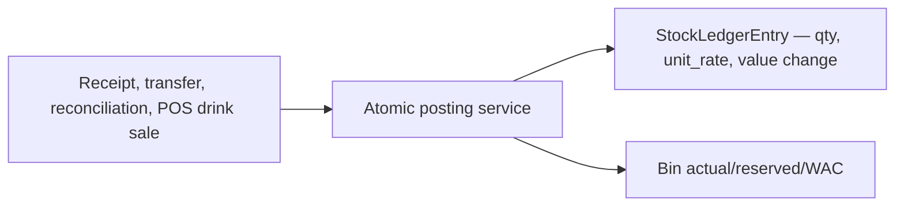

# Inventory Workflow

## Inventory Architecture

Inventory has a current-state layer (`Bin` — current WAC) and an append-only movement layer (`StockLedgerEntry` — audit). Documents are draft containers; their service functions are what post movements. The ledger uses Perpetual Weighted-Average Cost (PWAC): Bin holds the single WAC, SLE records the movement's rate and value change.

## Every Production Inventory Mutation

| Path | Movement | Code |
|---|---|---|
| Material Receipt | Positive quantity into central Store | `inventory.services.submit_stock_entry()` |
| Material Transfer | Negative Store issue plus positive Kitchen/Bar receipt | `submit_stock_entry()` |
| Purchase Receipt | Positive quantity into central Store | `submit_purchase_receipt()` |
| Stock Reconciliation | Signed difference to counted quantity | `submit_stock_reconciliation()` |
| POS DRINKS settlement | Negative quantity from order warehouse | `orders.services._convert_drink_reservations()` |
| Submitted DRINKS cancellation | Positive reversal quantity | `orders.services._restore_stock()` |
| Draft drink cart mutation | `Bin.reserved_qty`, not actual stock | `orders.services.reserve_drink_stock()` |

FOOD POS sales intentionally do not reserve or deduct stock. Kitchen consumption is an explicit `CONSUMPTION` reconciliation at the FOOD production warehouse.

## Bins and Reservations

`Bin` is unique per item/warehouse. DRINKS draft lines reserve `actual_qty - reserved_qty`; the order pins the configured Bar/POS warehouse on first reservation. Add, increase, decrease, remove, clear, draft cancel, draft discard, and draft deletion synchronize reservations. Settlement subtracts the order-owned reservation before creating the actual issue.

## PWAC Posting

`StockLedgerEntry._create_entry_locked()` locks a Bin, reads its current WAC, then: inbound `qty > 0` blends `new_wac = (old_qty*old_wac + qty*actual)/new_qty` and records `stock_value_change = qty*actual`; outbound `qty < 0` uses current WAC (`value_change = qty*WAC`, WAC unchanged). It records `quantity`, `unit_rate`, `stock_value_change`, `posting_date` (business date, informational), and `variance` on reversals. `InsufficientStock` rejects any move that would make actual quantity negative. No queue, no replay; `posting_date` never affects valuation.

## Documents

### Stock Entry

Supports `MATERIAL_RECEIPT` and `MATERIAL_TRANSFER`. Receipts land at `Restaurant.store_warehouse`. Transfers are only Store -> FOOD production warehouse or Store -> `Restaurant.default_warehouse` for DRINKS. Source/target compatibility and distinct warehouses are validated before locked bins are posted.

### Purchase Receipt

`PurchaseReceiptForm.clean()` and `submit_purchase_receipt()` force the configured Store warehouse. Each line must be enabled, stock-tracked, purchase-enabled, non-template, positive quantity, and non-negative rate. Each line records the UOM it was bought in (the item's base unit or one of its `uom_conversions`) with a snapshotted `conversion_factor`; on submit the ledger stores `received_qty × factor` at `rate ÷ factor`, so WAC and stock live in the base (sellable) unit. `Item.last_purchase_rate` is updated to the per-base-unit value (`rate ÷ factor`). The `supplier_name` free-text field is required unless a `Supplier` master is selected, in which case the master's name is copied onto the receipt so it stays readable on its own.

### Stock Reconciliation

The user enters a count. Submission locks bins and posts `count - actual` only. Opening Stock uses the `OPENING_STOCK` reason and can seed valuation with an entered rate. Ordinary reconciliations use the physical-count, consumption, waste/damage, or correction reasons. Non-opening counts cannot fall below reserved quantity. `CONSUMPTION` is restricted to FOOD items at the Kitchen warehouse. Cancellation reverses the voucher entries. Reconciliation detail history includes both the original movements and any cancellation reversals.

## Reversal and Immutability

Document cancellations create reversal SLEs at current WAC with `reversal_of_sle` linking back to the original, never editing it. Purchase receipt cancellation is blocked when a submitted invoice (or allocated payment) exists; allowed cancellations compute `variance = qty*(current_wac − original_rate)` as `CANCELLATION_WAC` to the variance account. Transfer cancellation reverses at dest current WAC (net zero). Stock-entry detail history includes both the original movements and their cancellation reversals. Parent document saves reject post-submit edits. However, `StockLedgerEntry` has no model-level save/delete guard, and direct status changes can bypass service posting.

## Backoffice Surface

Inventory views provide item/UOM/group/warehouse CRUD, document formsets, POST submit/cancel actions, stock ledger filters, stock balance filters, and a low-stock dashboard. All are login-protected; `/backoffice/` access is enforced by middleware rather than per-view manager checks.
