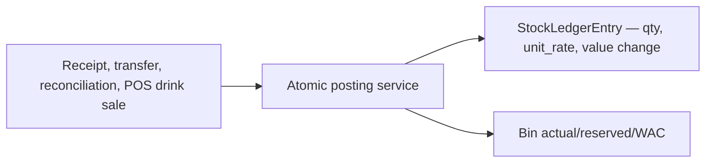

# Inventory Workflow

## Inventory Architecture

Inventory has a current-state layer (`Bin` — current WAC) and an append-only movement layer (`StockLedgerEntry` — audit). Documents are draft containers; their service functions are what post movements. The ledger uses Perpetual Weighted-Average Cost (PWAC): Bin holds the single WAC, SLE records the movement's rate and value change.

## Every Production Inventory Mutation

| Path | Movement | Code |
|---|---|---|
| Material Receipt | Positive quantity into central Store | `inventory.services.submit_stock_entry()` |
| Material Transfer | Negative Store issue plus positive Kitchen/Bar receipt | `submit_stock_entry()` |
| Purchase Receipt | Positive quantity into central Store | `submit_purchase_receipt()` |
| Stock Reconciliation | Signed difference to counted quantity | `submit_stock_reconciliation()` |
| POS DRINKS settlement | Negative quantity from order warehouse | `orders.services._convert_drink_reservations()` |
| Submitted DRINKS cancellation | Positive reversal quantity | `orders.services._restore_stock()` |
| Draft drink cart mutation | `Bin.reserved_qty`, not actual stock | `orders.services.reserve_drink_stock()` |

FOOD POS sales intentionally do not reserve or deduct stock. Kitchen consumption is an explicit `CONSUMPTION` reconciliation at the FOOD production warehouse.

## Bins and Reservations

`Bin` is unique per item/warehouse. DRINKS draft lines reserve `actual_qty - reserved_qty`; the order pins the configured Bar/POS warehouse on first reservation. Add, increase, decrease, remove, clear, draft cancel, draft discard, and draft deletion synchronize reservations. Settlement subtracts the order-owned reservation before creating the actual issue. FOOD lines never reserve or deduct.

## Recipes and Actual-vs-Theoretical Usage

Each sellable FOOD item may carry one active recipe card (`Recipe` + `RecipeItem` rows): ingredients in `stock_uom`, yield baked into the qty (0.125 kg per plate, not per bag). Variants and sellable add-ons hold their own cards; drinks have none; a dish with no recipe sells fine and lands on the unmapped list. `inventory.services.recipe_plate_cost()` prices one portion at Kitchen WAC (else last rate) for display; `compute_food_usage(business_date)` is the single source behind the Food usage page and the P&L — theoretical (recipe × submitted FOOD sales, returns netted) against actual (Kitchen `CONSUMPTION` + `WASTE_DAMAGE` SLEs, `ADJUSTMENT` excluded), one shared rate per ingredient, variance as a quantity story.

## PWAC Posting

`StockLedgerEntry._create_entry_locked()` locks a Bin, reads its current WAC, then: inbound `qty > 0` blends `new_wac = (old_qty*old_wac + inbound_value)/new_qty` and records `stock_value_change = inbound_value` (default `qty × actual`; purchase-receipt submit passes the as-bought line amount); outbound `qty < 0` uses current WAC (`value_change = qty*WAC`, WAC unchanged). It records `quantity`, `unit_rate`, `stock_value_change`, `posting_date` (business date, informational), and `variance` on reversals. `InsufficientStock` rejects any move that would make actual quantity negative. No queue, no replay; `posting_date` never affects valuation.

## Documents

### Stock Entry

Supports `MATERIAL_RECEIPT` (market purchase — posts Dr SIH / Cr the payment mode's GL account selected as "Paid from"; no GRNI) and `MATERIAL_TRANSFER`. Receipts land at `Restaurant.store_warehouse`. Each receipt line records the UOM it was bought in (the item's stock unit or one of its `uom_conversions`) with a snapshotted `conversion_factor`; on submit the ledger stores `(qty × factor)` and blends WAC on the as-bought `amount`, mirroring purchase receipts. Transfers are entered in the item's stock unit only. Transfers are only Store -> FOOD production warehouse or Store -> `Restaurant.default_warehouse` for DRINKS. Source/target compatibility and distinct warehouses are validated before locked bins are posted.

### Purchase Receipt

`PurchaseReceiptForm.clean()` and `submit_purchase_receipt()` force the configured Store warehouse. Each line must be enabled, stock-tracked, purchase-enabled, non-template, positive quantity, and non-negative rate. Each line records the UOM it was bought in (the item's stock unit or one of its `uom_conversions`) with a snapshotted `conversion_factor`. On submit the ledger stores stock quantity `(received_qty × factor)` and blends WAC using the as-bought `amount` (`received_qty × rate`), not `stock_qty × (rate ÷ factor)`, so money on GRNI/SIH matches the paperwork while WAC lives per bottle/kg. `Item.last_purchase_rate` is set to `amount ÷ stock_qty`. The `supplier_name` free-text field is required unless a `Supplier` master is selected, in which case the master's name is copied onto the receipt so it stays readable on its own. Purchase receipt detail history includes both the original movements and any cancellation reversals. Stock Entry market receipts use the same as-bought UOM conversion.

### Stock Reconciliation

Four reasons (`OPENING_STOCK`, `ADJUSTMENT`, `CONSUMPTION`, `WASTE_DAMAGE`). The `purpose` field is removed — `reason` alone carries the semantics.

| Reason | What the line qty means | SLE posted |
|---|---|---|
| Opening Stock | Counted quantity on hand (first seeding of a fresh warehouse) | `count − actual` |
| Adjustment | Counted quantity on hand, up or down | `count − actual` |
| Consumption | End-of-day count of what is left | `count − actual` (outbound only) |
| Waste / Damage | Quantity wasted, entered positive | `−qty` |

Guards: Opening Stock requires a warehouse with zero stock ledger entries (including cancelled ones) and an entered valuation rate for positive lines. Adjustment requires counted qty ≥ reserved. Consumption is FOOD items at the Kitchen warehouse only, requires counted qty ≥ reserved, rejects a count above the bin (run an Adjustment first), and treats a count equal to the bin as a no-op. Waste requires wasted qty > 0 and ≤ on-hand minus reserved, on any warehouse. Remarks are optional on every reason. Submit and cancel stamp `submitted_by`/`submitted_at` and `cancelled_by`/`cancelled_at` from the acting user.

GL posts per SLE at `abs(qty) × SLE unit rate` (outbound at bin WAC; inbound at the entered seeding rate or bin WAC fallback): Opening inbound Dr warehouse / Cr `Restaurant.temporary_opening_account` (must be a balance-sheet account, never P&L); Adjustment outbound Dr `Restaurant.stock_adjustment_account` / Cr warehouse (inbound reverses); Consumption Dr Kitchen unit expense (else `Restaurant.default_expense_account`) / Cr Kitchen warehouse; Waste Dr `Restaurant.wastage_account` / Cr warehouse. Missing accounts hard-fail submission. Cancellation mirrors and reverses every GL row for the voucher. Reconciliation detail history includes both the original movements and any cancellation reversals.

## Reversal and Immutability

Document cancellations create reversal SLEs at current WAC with `reversal_of_sle` linking back to the original, never editing it. Purchase receipt cancellation is blocked when a submitted invoice (or allocated payment) exists; allowed cancellations compute `variance = qty*(current_wac − original_rate)` as `CANCELLATION_WAC` to the variance account. Transfer cancellation reverses at dest current WAC (net zero). Stock-entry market-receipt cancellation reverses `Cr SIH @ current WAC / Dr funding account @ original` with drift to the variance account. Stock-entry detail history includes both the original movements and their cancellation reversals. Parent document saves reject post-submit edits. However, `StockLedgerEntry` has no model-level save/delete guard, and direct status changes can bypass service posting.

## Backoffice Surface

Inventory views provide item/UOM/group/warehouse CRUD, document formsets, POST submit/cancel actions, stock ledger filters, stock balance filters, and a low-stock dashboard. The item form includes a UOM-conversions formset (shown when the item is stock-tracked and purchasable). Purchase-receipt lines offer a UOM dropdown of the stock unit plus that item's conversions, with a stock-qty preview. All are login-protected; `/backoffice/` access is enforced by middleware rather than per-view manager checks.
